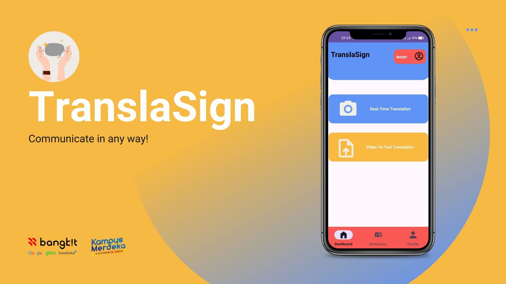

# TranslaSign
This repository documents the process and components of the TranslaSign Application for Hand Sign Language Translation based on Hand Sign Detection.

## Overview

## Documentation Structure
## 1. Model Documentation
#### Objective
Building a model for hand sign detection based on image recognition.

#### Requirements
* tensorflow 2.12.*
* OpenCV
* tensorflowjs
* numpy
* PIL
* zipfile
* os
* shutil
#### Steps Taken

1. *Data Collection:*
   - Sourced relevant datasets for model training.
   - Public datasets such as American Sign Language (ASL) datasets.

2. *Model Training:*
   - Data Splitting: Dividing the data into training, validation, and test sets.
   - Model Architecture Selection: Choosing and implementing the appropriate model architecture, such as CNN for feature extraction. We also do transfer learning method from mobilenet (for cloud based classification) and VGG16 (for real time classification) model that seems fit with our classification scenarios.
   - Training and Evaluation: Training the model using the training data and evaluating its performance with the validation and test data. Also we do some local testing using webcam to provide more accuracy especially in real life applications.

3. *Model Creation:*
   - Saved the trained model as .h5 file.
   - Convert model from hdf-5 format into deployment fit format such as .tflite and json.

4. *Model Utilization:*
   - Fine-tuned normalization techniques for image preprocessing.

## 2. Cloud Documentation
The TranslaSign application uses Google Cloud Platform to share and store data. The google cloud project is connected to firebase because the application also uses firebase authentication and firebase firestore

#### Requirement
- Git
- Code editor (Visual studio code)
- Google Cloud Account

#### Cloud Architecture

Architecture Illustration

#### 1. Setup Google Cloud Platform
- Create Project & Configure Identity and Access Management
- Enable the following API :
  -  App Engine API
  -  Cloud Run Admin API
  -  Cloud Firestore API

#### 2. Download Google Cloud SDK and Run Cloud Shell in Your Code Editor
- Download Google Cloud SDK & Install

#### 3. Setup Firebase 
- Open [Firebase](https://firebase.google.com/), go to console & connect it To Google Cloud Project
- Active Firebase Auth & Firebase Firestore
- Make a **Service Account** and download the file

#### 4. Clone Project and Set Google Cloud account
- Open your code editor (we recommend using Visual Studio Code)
- open [TranslaSign-Backend]([-](https://github.com/fahmimramdan6/TranslaSign/tree/main/Cloud%20Computing)) and clone it to your local folder or use "git clone .-" in terminal
- In terminal use "**git init**" and connect your google cloud account

#### 5. Set Project and Deploy Application to App Engine
- Set your project in the terminal by execute "gcloud config set project **your-project**"

## 3. Mobile Documentation
#### Objective
Developing TranslaSign application for Android devices.

#### Steps Taken

1. *UI Design*
   - Design the application's interface using Figma.
   - Using Material 3 Components for most of the design.

2. *App Development*
   - Developed the application using Android Studio with Native Kotlin as the programming language.
   - Implemented a machine learning model to recognize live-camera sign language.
   - Integrated data retrieval using API to handle authentication, video-to-text translation, and image database.

3. *Testing and Optimization*
   - Conducted thorough testing to ensure seamless functionality.
   - Optimized the machine learning model used to enable hardware acceleration.
  
**You can download the APK [here](https://drive.google.com/file/d/1x8o6qb2LeBmVVTyTjIjBrD3H_cytsPtB/view?usp=drive_link).**

## Team Member
All Team Member that contributed for the success of this project from discussing idea until part integration  
Team ID: C241-PS507  
| Name                      | ID           | Learning Path      | University             | LinkedIn |
|---------------------------|--------------|--------------------|------------------------|----------|
| Timothy Adamentha Tarigan | M180D4KY1667 | Machine Learning   | Airlangga University   |<a href='https://www.linkedin.com/in/timothy-adamentha-tarigan-964326247'>LinkedIn</a>|
| Fahmi Mohamad Ramdan      | M011D4KY3350 | Machine Learning   | Padjadjaran University |<a href='https://www.linkedin.com/in/fahmimramdan'>LinkedIn</a>|
| Hanafi Husnipradja        | M011D4KY3266 | Machine Learning   | Padjadjaran University |<a href='https://www.linkedin.com/in/hanafi-husnipradja/'>LinkedIn</a>|
| Muhamad Azriel Mauladin   | A476D4KY4556 | Mobile Development | Widyatama University   |<a href='https://www.linkedin.com/in/muhamad-azriel-13680621b'>LinkedIn</a>|
| Tangana Vito Fortunata    | A170D4KY3418 | Mobile Development | STMIK LIKMI            |<a href='https://www.linkedin.com/in/tangana-vito-6720022ba'>LinkedIn</a>|
| Sultan Zhorgy Pratama Hrp | C012D4KY0975 | Cloud Computing    | Telkom University      |<a href='https://id.linkedin.com/in/sultan-zhorgy-pratama-hrp-8a4728285'>LinkedIn</a>|
| Fauzan Maulana            | C012D4KY0567 | Cloud Computing    | Telkom University      |<a href='http://linkedin.com/in/fauzan-maulana-4090902a2'>LinkedIn</a>|

